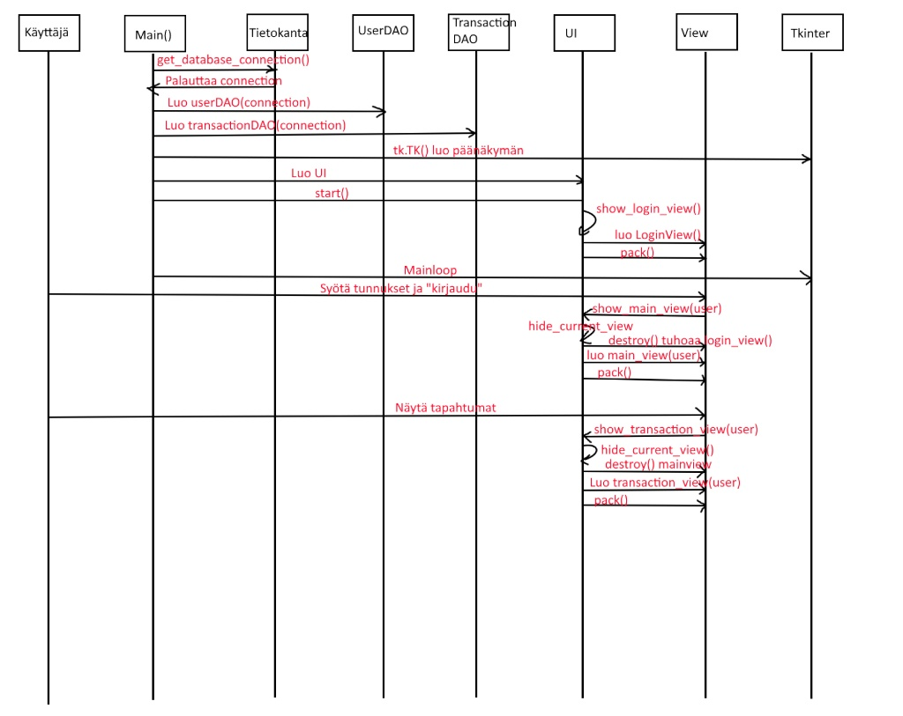

# Sekvenssikaavio

## Rakenne
Ohjelman rakenne noudattelee kerrosarkkitehtuuria, ja koodin pakkausrakenne on jaettu selkeisiin kokonaisuuksiin:

**UI** sisältää käyttöliittymästä vastaavan koodin. **DAO** (Data Access Object) vastaa tietojen pysyväistallennuksesta tietokantaan ja tietokantakyselyistä (esim. UserDAO ja TransactionDAO). **Database** sisältää tietokantayhteyden luomiseen ja alustukseen liittyvän koodin.

## Käyttöliittymä
Käyttöliittymä on toteutettu Tkinker-kirjatolla ja se sisältää erillisä näkymiä.
- Kirjautuminen **(loginView)**
- Päänäkymä **(main_view)**
- Tapahtumanäkymä **(transaction_view)**