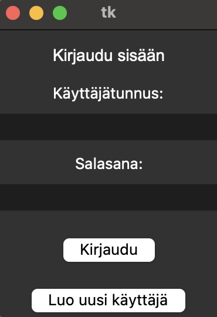
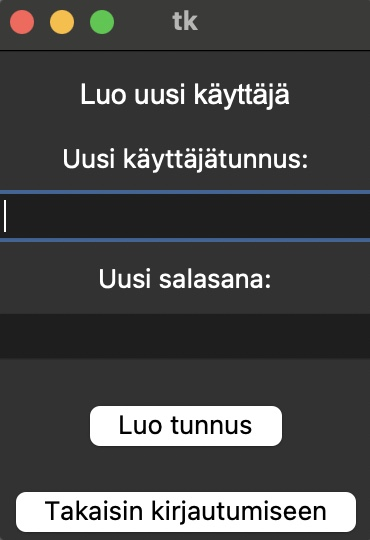
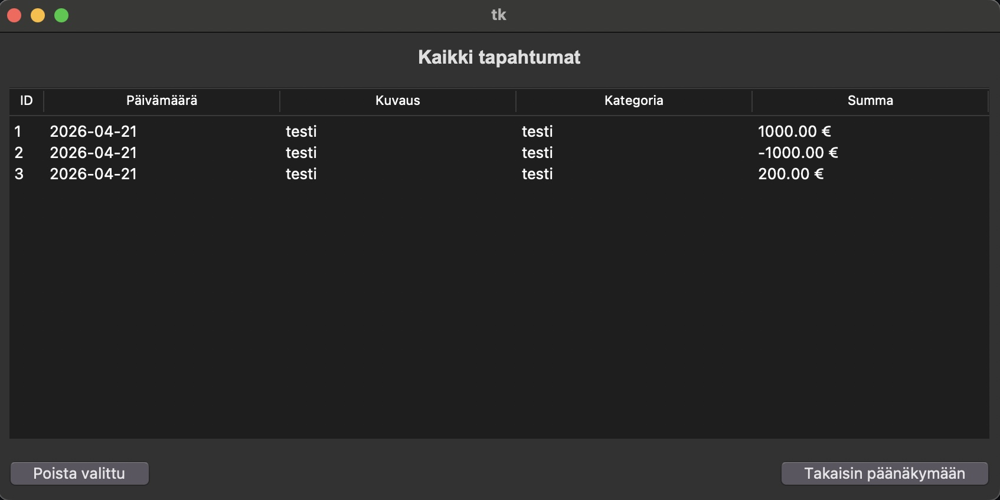

# Käyttöohje

Lataa projektin viimesin versio

## Ohjelman käynnistäminen

Ennen ohjelman käynnistämistä, asenna tarvittavat riippuvuudet:

```bash
poetry install
```
Suorita seuraavaksi projektin alustustoimenpiteet:

```bash
poetry run invoke build
```
Ohjelma on nyt käyttövalmis! Voit käynnistää sen komennolla:

```bash
poetry run invoke start
```

## Kirjautuminen
Sovelluksen käynnistyttyä aukeaa kirjautumis näkymä



Olemassa olevilla käyttäjätunnuksilla voi kirjautua tässä vaiheessa.

## Käyttäjän luominen
Kirjautumis näkymästä pääsee käyttäjän luomis näkymään.
Uusi käyttäjä luodaan lisäämällä halutut tunnukset kenttiin ja painamalla "Luo tunnus"



Käyttäjän luomisen jälkeen kirjaudu tekemilläsi tunnuksilla

## Tulojen ja menojen kirjaaminen


Onnistuneen kirjautumisen myötä siirrytään sovelluksen päänäkymään, jossa näet nykyisen budjettisi saldon sekä listan aiemmin lisätyistä tapahtumista.

Uuden tapahtuman lisääminen:
1. Kirjoita tekstikenttään "Kuvaus" tapahtuman kuvaus (esim. "Ruokaostokset" tai "Palkka lokakuu").
2. Lisää kategoria kohtaan (esim. Ruoka, Viihde, Tulot")
2. Syötä summa sille varattuun kenttään. Jos kyseessä on meno, lisää eteen - etumerkki. Jolloin se vähennetään saldosta.
3. Paina "Tallenna" painiketta lisätäksesi tapahtuman

Lisätty tapahtuma ilmestyy välittömästi listaan, ja budjettisi kokonaissaldo päivittyy vastaamaan uutta tilannetta. 


## Tapahtumien tarkastaminen ja poistaminen

Painamalla pää näkymässä painiketta "Näytä tapahtumat" pääset näkymään missä on listattu kaikki lisätyt tapahtumat.
Voit poistaa tapahtuman painamalla haluttua tapahtumaa ja alhaalta painikkeella "Poista valittu"

